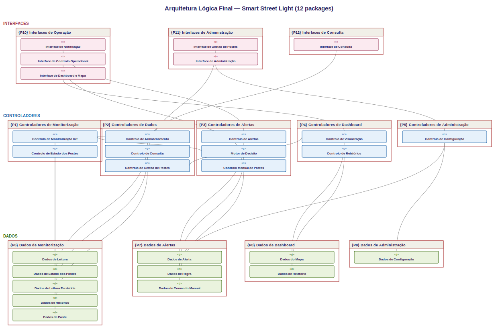

# Smart Street Light and Power Consumption Monitoring System

Sistema de **iluminação pública inteligente** para a cidade de **Braga**. Os postes regulam automaticamente o brilho conforme a luz ambiente, o consumo de energia é monitorizado, as avarias são detetadas e tudo é apresentado num painel com mapa, gráficos, relatórios e alertas.

> Projeto académico — ioAcademy Challenge, Desafio 1 (IoT). Desenvolvido segundo o método **4SRS** (dos casos de uso à arquitetura lógica e ao código).

---

## Objetivo do projeto

A iluminação pública tradicional fica no máximo toda a noite, desperdiçando energia. Este sistema regula o brilho conforme a luz natural (apaga de dia, máximo de noite, intermédio ao entardecer), reduz o consumo e o custo, deteta postes avariados e dá ao operador uma visão completa da rede.

---

## Principais funcionalidades

- Mapa real de Braga com os postes coloridos por estado
- Regulação automática do brilho (motor de decisão)
- Deteção de avarias e gestão de alertas
- Gráficos de consumo (evolução no tempo e por zona)
- Relatório de custo e poupança por poste
- Exportação de dados em CSV
- Login com perfis (Operador e Administrador)
- Simulador Python que faz o papel dos postes

---

## Tecnologias usadas

| Camada | Tecnologia |
|--------|------------|
| Backend | Java 21 + Spring Boot |
| Base de dados | H2 (em memória) |
| Frontend | HTML + JavaScript, Leaflet (mapa), Chart.js (gráficos) |
| Simulador | Python (requests) |
| Build | Maven |

---

## Arquitetura geral

O projeto segue o método 4SRS. Cada caso de uso foi transformado em objetos de **interface**, **controlo** e **dados**, agrupados em **12 packages** (P1 a P12). O código respeita exatamente esses packages.



| Package | Conteúdo |
|---------|----------|
| P1–P5 | Controladores (monitorização, dados, alertas, dashboard, administração) |
| P6–P9 | Dados / entidades (monitorização, alertas, dashboard, administração) |
| P10–P12 | Interfaces REST (operação, administração, consulta) |

Regra de tradução: **interface → @RestController**, **controlo → @Service**, **dados → @Entity + Repository**.

---

## Casos de uso representados

São **28 casos de uso**, todos presentes na aplicação. Resumo:

- **Foco 1 (Monitorização):** receber, validar e registar leituras; monitorizar estado
- **Foco 2 (Dados):** guardar, associar e calcular consumo; consultar histórico; gerir postes
- **Foco 3 (Alertas/Decisão):** detetar/notificar/registar alertas; motor de decisão; controlo manual
- **Foco 4 (Dashboard):** mapa; gráficos de consumo; relatório de custo e poupança
- **Foco 5 (Administração):** configurar regras; gerir utilizadores; exportar CSV

---

## Simulador Python

Faz o papel dos postes inteligentes (que na realidade teriam sensor de luz e medidor de energia). Envia a cada 5 segundos, para `/api/leituras`, a luminosidade e a potência de cada poste. O backend decide o brilho e deteta avarias.

```bash
cd simulador
pip install requests
python simulador.py
```

Ver [simulador/README.md](simulador/README.md) para detalhes.

---

## Mapa de Braga

Mapa Leaflet/OpenStreetMap com os 12 postes em locais reais (Avenida Central, Sé, Bom Jesus, Universidade do Minho, etc.). Cada poste é um círculo: verde (ligado), amarelo (desligado), vermelho (falha). Ao clicar, mostra estado, brilho, luz e última atualização.


---

## Alertas

Um alerta de FALHA é criado quando um poste reporta 0W de potência estando de noite (devia estar aceso). O poste fica em falha (vermelho) até o operador carregar em **Resolver**, que repõe o poste a funcionar (simula a equipa de manutenção).

---

---

## Exportação CSV

No menu Exportar CSV, é possível descarregar o histórico de leituras e o estado dos postes. Os ficheiros são gerados a partir da base de dados e servem para relatórios e auditoria.

---

## Como instalar

Pré-requisitos: **Java 21** (adoptium.net), **VS Code** com Extension Pack for Java e Spring Boot Extension Pack, **Python** (para o simulador).

---

## Como correr o backend

1. Abrir a pasta do projeto no VS Code.
2. Abrir `src/main/java/com/smartlight/streetlight/StreetlightApplication.java`.
3. Clicar em **Run** (ou no terminal: `mvnw spring-boot:run`).
4. Aguardar a mensagem `Started StreetlightApplication`.

---

## Como correr o simulador Python

Num segundo terminal:

```bash
cd simulador
pip install requests
python simulador.py
```

---

## Como abrir a app no browser

Abrir **http://localhost:8080**. Contas de demonstração:

- Administrador: `admin` / `admin123`
- Operador: `operador` / `op123`

---

## Como demonstrar a aplicação

1. Abrir a app e mostrar o login com perfis.
2. Entrar como Operador (vê operação/consulta) e depois como Admin (vê tudo).
3. Mostrar o mapa de Braga e ligar a atualização automática.
4. Correr o simulador e ver os postes a mudar ao vivo.
5. Mostrar um alerta a surgir e resolvê-lo.
6. Mostrar gráficos, relatório de poupança e exportação CSV.
7. Explicar que cada package do código corresponde a um package da arquitetura 4SRS.

---

## Estrutura do projeto

```text
streetlight/
├── src/main/java/com/smartlight/streetlight/   # 12 packages P1-P12
├── src/main/resources/
│   ├── static/index.html                       # interface web
│   └── application.properties                  # configuração
├── simulador/                                   # simulador Python
├── docs/                                        # documentação e imagens
├── README.md
├── .gitignore
└── pom.xml
```

---

## Autores

- Sofia Silva 

---

## Limitações e melhorias futuras

- Base de dados em memória (perde dados ao desligar) → usar PostgreSQL/MySQL
- Comunicação HTTP → evoluir para MQTT (protocolo IoT típico)
- Consumo simplificado (80W por leitura) → medição contínua de energia
- Sem filtros no CSV → adicionar filtros por data/zona
